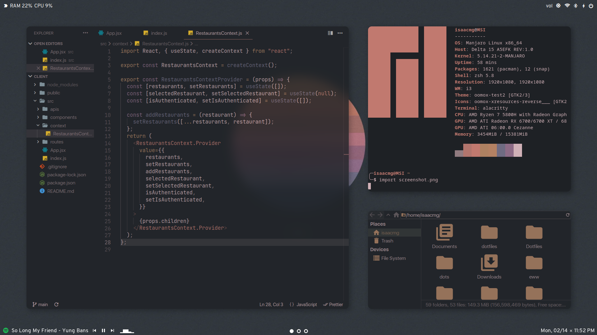
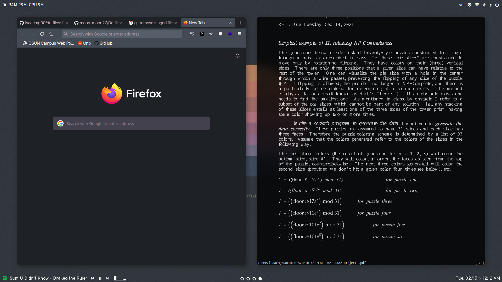

NOTE: This repository is out of date and configurations may contain deprecated code & projects, so feel free to copy at your own risk.

As of July 2022, I migrated over to a bspwm rice.
### Screenshots:

### :computer: System Information:

These are some of the applications that I use in my current setup. 

- **Distro**: Manjaro Linux 5.14.21-2
- **Window Manager**: [i3-gaps](https://github.com/Airblader/i3)  
- **Shell**: [zsh](https://ohmyz.sh/)
- **Compositor**: [picom](https://github.com/ibhagwan/picom) (ibhagwan fork)
- **Terminal**: [Alacritty](https://github.com/alacritty/alacritty)  
- **App Launcher/Powermenu**: [rofi](https://github.com/davatorium/rofi)   
- **Panel**: [Polybar](https://github.com/polybar/polybar) & [Eww](https://github.com/elkowar/eww)
- **Text Editor**: [VS Code](https://github.com/microsoft/vscode)
- **PDF Viewer**: [Zathura](https://pwmt.org/projects/zathura/) 
- **File Manager**: [Thunar](https://wiki.archlinux.org/title/thunar)
- **Notification-daemon**: [Dunst](https://wiki.archlinux.org/index.php/Dunst)  

### :rainbow: Application themes and extensions:

These provide for system-wide theme consistency based off the current wallpaper. See [pywal](https://github.com/dylanaraps/pywal).

- **Firefox**: [pywalfox](https://github.com/frewacom/pywalfox)  
- **Spotify**: [spicetify](https://spicetify.app/)  
- **Discord**: [BetterDiscord](https://betterdiscord.app/) to allow custom CSS themes, [pywal-discord](https://github.com/FilipLitwora/pywal-discord) to apply current wal color scheme.
- **GTK**: [oomox](https://github.com/themix-project/oomox) & [lxappearance](https://archlinux.org/packages/community/x86_64/lxappearance/)

### :pencil2: Fonts:  
- **Terminal**: Hack  
- **Polybar (bottom) & Eww (top) panels**: [Overpass](https://github.com/RedHatOfficial/Overpass), [FontAwesome](https://fontawesome.com/) and [Material Icons](https://google.github.io/material-design-icons/) for the glyphs/icons.

